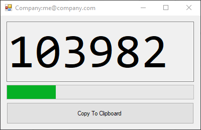
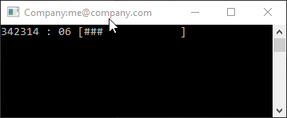

[](https://opensource.org/licenses/mit-license.php)

[](https://github.com/ellerbrock/open-source-badges/)

# whos-down-with-otp
Simple OTP generator using TOTP





# Setup
Open the app.config file in the console and/or UI directory.  This can be done any time after the code is built as well.
Add/Change the following

```xml
<appSettings>
      <add key="TotpKey" value="--key goes here--" />
      <add key="OtpDigits" value="6" />
      <add key="OtpWindow" value="30" />
      <add key="TotpAccountName" value="My Account Name" />
  </appSettings>
```

``` 
TotpKey: base32 encoded string from your setup (modern apps use the QR code)
OtpDigits: The number of digits the server wants (default 6)
OtpWindow: Number of seconds code is valid (default 30)
TotpAccountName: Optional Name
```
